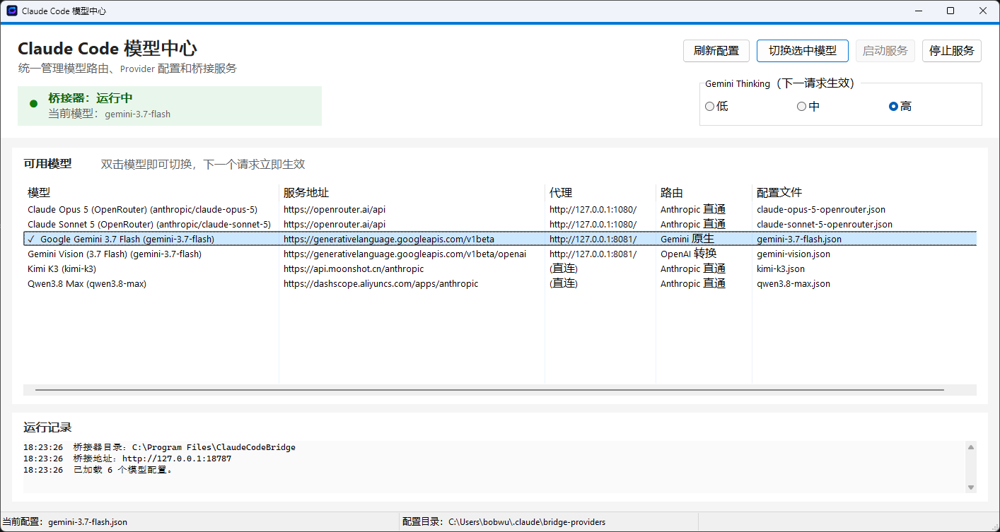

# Claude Code ↔ Gemini Deep-Compatibility Bridge

**A protocol-aware Rust bridge built specifically to make Gemini behave like a first-class Claude Code backend—not merely an OpenAI-shaped chat endpoint—with live model switching that does not require restarting VS Code or Claude Code.**

**一个专门为 Claude Code 打造的协议级 Rust 本地桥接器与多模型路由器。它针对 Gemini 的思维链流式输出、工具调用状态机、思考签名（Thought Signature）、多模态工具结果、JSON Schema 严格校验与安全拦截等进行了深度适配；配合配套 GUI，无需重启 VS Code 或 Claude Code 即可随时免打扰热切换 Gemini、DeepSeek、Kimi、Claude 等模型。**

---



*The bundled model center keeps Claude Code on one stable local endpoint while Gemini, DeepSeek, Kimi, Claude, Qwen, proxy settings, and other compatible profiles can be switched live. The next request uses the selected route—no VS Code reload or Claude Code restart required.*  
*配套的模型中心 GUI 让 Claude Code 始终连接到固定的本地端点，双击即可在 Gemini、DeepSeek、Kimi、Claude、Qwen 以及代理设置之间即时热切换。下一个请求立即生效——无需重新加载 VS Code 或重启 Claude Code。*

---

## Claude Code × 原生 OpenAI 接口：这次升级为什么重要

这不是简单地“多支持了几个模型”，而是把 Claude Code 的 Agent 能力与模型供应商的 API 协议真正解耦了：

```text
Claude Code（Agent、MCP、工具调用、任务编排）
        ↓ Anthropic Messages
Claude Code Multi-Model Bridge（协议转换、身份适配、热路由）
        ↓ OpenAI Chat Completions
Gemini / DeepSeek / Kimi / Qwen / OpenRouter / 其他兼容模型
```

过去，下游供应商必须提供 Anthropic 兼容地址，用户还要把它的配置写进 `ANTHROPIC_*` 历史字段。现在，供应商只要提供较完整的 OpenAI Chat Completions 接口，就可以通过桥接器成为 Claude Code 的真实下游模型。Claude Code 继续提供成熟的编程 Agent、MCP 和工具生态；模型请求则发送到供应商官方原生 OpenAI 接口。

这带来了几个直接收益：

- **可用模型范围显著扩大：** 不再等待供应商单独实现 Anthropic Messages 接口；已有 OpenAI 兼容接口即可接入。
- **使用供应商原生路径：** `base_url`、API Key 和模型 ID 直接来自供应商官网 OpenAI SDK 示例，不再把非 Claude 模型伪装成 Anthropic Provider。
- **回答仍由下游模型生成：** 桥接器负责协议转换、路由和必要的身份提示适配，不通过关键词代答，也不改写模型最终输出。
- **配置成本大幅降低：** 通常只需 `model`、`base_url`、`api_key` 三个字段；一个 JSON 文件就是一个可切换模型。
- **保留 Claude Code 的工作流价值：** 多轮任务、代码工具、MCP、并行工具调用与 GUI 热切换仍由 Claude Code 和桥接器共同承载。
- **切换无需重启：** 新增或修改 Provider 文件后，在模型中心点击刷新并切换，下一个请求立即走新模型。

这里有一个重要边界：支持 OpenAI Chat Completions 并不代表所有普通聊天模型都能完整胜任 Claude Code。要获得可靠的 Coding Agent 体验，下游模型仍应正确支持流式输出、工具调用、结构化参数，并具备足够的上下文长度和代码能力。

### 三分钟添加一个 OpenAI Provider

1. 打开配置目录：

   ```text
   %USERPROFILE%\.claude\bridge-providers\
   ```

2. 参考供应商官网的 OpenAI SDK 示例，新建一个 `.json` 文件，例如 `deepseek.json`：

   ```json
   {
     "name": "DeepSeek",
     "model": "deepseek-chat",
     "base_url": "https://api.deepseek.com",
     "api_key": "sk-...",
     "protocol": "openai",
     "identity": "DeepSeek"
   }
   ```

3. 字段与官网示例一一对应：

   | 供应商官网 OpenAI 示例 | Provider JSON | 说明 |
   | --- | --- | --- |
   | `OpenAI(api_key=...)` | `api_key` | API Key；也可用 `api_key_env` 引用服务环境变量 |
   | `OpenAI(base_url=...)` | `base_url` | 复制 SDK 基地址，桥接器自动补 `/chat/completions` |
   | `chat.completions.create(model=...)` | `model` | 原样填写供应商当前模型 ID |

4. 保存后打开“Claude Code 模型中心”，点击“刷新配置”，选择该模型即可。无需修改 Claude Code 的活动配置，也无需重启 VS Code、Claude Code 或桥接服务。

常见官方 OpenAI 兼容基地址示例：

| Provider | `base_url` |
| --- | --- |
| DeepSeek | `https://api.deepseek.com` |
| Kimi / Moonshot | `https://api.moonshot.cn/v1` |
| Qwen / 百炼（中国区） | `https://dashscope.aliyuncs.com/compatible-mode/v1` |
| OpenRouter | `https://openrouter.ai/api/v1` |
| Google Gemini | `https://generativelanguage.googleapis.com/v1beta/openai` |

如供应商给出的是完整请求地址，或者网关路径不遵循 SDK 基地址规则，可以额外填写 `endpoint`。代理、身份名称、禁用开关、密钥环境变量和旧配置迁移方法见完整的 [Provider 配置指南](PROVIDER_CONFIG.md)，也可以直接复制 [Provider 模板](examples/providers) 修改。

> Claude Code 自己的 `%USERPROFILE%\.claude\settings.json` 仍然使用 `ANTHROPIC_BASE_URL=http://127.0.0.1:18787` 连接本地桥接器。这是 Claude Code 客户端协议的入口，不是上游模型配置；上游 Provider 已经不再依赖 `ANTHROPIC_*` 字段。

### Why this matters

Claude Code can now keep its agent, MCP, tool-use, and orchestration workflow while the actual model is reached through the provider's native OpenAI Chat Completions API. Providers no longer need to implement an Anthropic-compatible endpoint. The bridge translates the protocol and routes requests; the selected downstream model still generates the answer. In most cases, users only copy `model`, `base_url`, and `api_key` from the provider's official OpenAI SDK example into one JSON file.

## English Version

> New provider configuration: copy the three values from a provider's official
> OpenAI-compatible example into a JSON file under
> `%USERPROFILE%\.claude\bridge-providers\`. See the detailed
> [Provider configuration guide](PROVIDER_CONFIG.md) and the ready-to-copy
> [templates](examples/providers).

### Why this is different from a generic bridge

A generic bridge often stops after mapping `messages`, `content`, and `tool_calls`. That is enough for a chat demo, but coding agents exercise a much larger protocol surface: interleaved thinking and text, streamed partial JSON, parallel tools, multimodal tool results, strict schemas, truncated generations, and provider-specific state that must survive a tool round trip.

This bridge handles those behaviors explicitly:

| Compatibility surface | Common generic-bridge behavior | This project |
| --- | --- | --- |
| Streaming | Buffers the upstream response or assumes each network chunk is one SSE event | Calls Gemini with `stream: true`, incrementally decodes SSE across UTF-8 and network boundaries, and forwards Anthropic events as they become valid |
| Extended thinking | Drops Gemini `reasoning_content` / `thinking` | Emits Anthropic `thinking` blocks and `thinking_delta` events, closes them before text or tools, and preserves thinking in non-streaming responses |
| Tool arguments | Forwards incomplete JSON fragments directly | Accumulates streamed fragments, preserves parallel-call order, validates the completed JSON object, then emits a valid Anthropic `tool_use` block |
| Gemini thought signatures | Loses `extra_content.google.thought_signature` after the first tool call | Caches signatures by tool-call ID and restores them on the next assistant/tool round trip, with bounded eviction |
| Tool-result ordering | Preserves Claude block order even when Gemini requires tool results immediately after assistant tool calls | Emits `role: tool` results before remaining user text/images while preserving tool-call identity |
| Multimodal tool results | Stringifies or drops image/document blocks | Converts base64 images and PDFs to Gemini-compatible `image_url` data URIs, including structured `tool_result` content |
| Tool schemas | Passes Anthropic JSON Schema through unchanged and receives Gemini HTTP 400 errors | Recursively removes unsupported `$schema`, `$id`, and `$comment`, traverses definitions/combinators/items, and infers `type: object` when `properties` is present |
| Safety filtering | Crashes on an empty `choices` array | Converts Gemini `promptFeedback.blockReason` into a valid Anthropic `refusal` message with a readable reason |
| Truncated tool calls | Executes malformed/empty arguments or reports the wrong stop reason | Maps cutoff responses to `max_tokens` and suppresses incomplete tool calls and uncached signatures |
| Token accounting | Uses a byte-only estimate that undercounts non-ASCII prompts | Uses a Unicode-aware conservative input estimate and updates usage from streamed Gemini usage data when available |
| Live model switching | Requires editing Claude settings and restarting/reloading the client whenever the provider changes | Keeps Claude Code connected to one stable local endpoint and switches OpenAI-compatible or Anthropic profiles from the GUI without restarting VS Code, Claude Code, or the bridge service |
| Operations | Runs as an ad hoc console proxy | Includes a native Windows service, delayed auto-start, recovery policy, graceful shutdown, health checks, persistent routing state, packaging, and a Delphi model-switcher GUI |

### Deep compatibility details

#### Thinking is translated as a real Anthropic content-block lifecycle

Gemini thinking is not exposed as ordinary assistant text. The streaming translator recognizes both `delta.reasoning_content` and `delta.thinking` and produces the event sequence Claude Code expects:

```text
Gemini reasoning token
  -> content_block_start(type=thinking)
  -> content_block_delta(type=thinking_delta)
  -> content_block_stop
  -> text or tool-use content begins
```

The thinking block is closed when normal text or a tool call arrives, and also during stream finalization. Non-streaming `reasoning_content` is prepended as an Anthropic `thinking` content block rather than silently discarded. This is what allows Claude Code to render its thinking state instead of appearing frozen while Gemini reasons.

#### Tool use is treated as a stateful protocol, not a JSON rename

- Streamed tool calls are keyed and accumulated in insertion order, including parallel tool calls whose IDs, names, and argument fragments arrive in different chunks.
- Completed arguments must parse as a JSON object before Claude Code sees the tool request.
- Gemini 3 thought signatures are captured from `extra_content.google.thought_signature`, stored in a bounded cache, and restored when Claude Code returns the corresponding tool result.
- A `length` / `max_tokens` finish suppresses unfinished tool calls so Claude Code never executes truncated arguments. Signatures from those invalid calls are not cached.
- Claude user messages that mix `tool_result`, text, and images are reordered only where Gemini's sequencing contract requires it: tool results immediately follow the assistant calls, while the remaining user content stays structured.

#### Tool results remain multimodal

Claude Code tools can return screenshots, images, or PDF documents. Instead of flattening these blocks into lossy text, the bridge emits structured OpenAI content parts for Gemini:

- Anthropic base64 image → `image_url` with `data:<media-type>;base64,...`
- Anthropic base64 PDF document → `image_url` with `data:application/pdf;base64,...`
- Mixed text and media → one structured `role: tool` content array
- `is_error: true` → preserved as an explicit tool-error text part without discarding accompanying media

This matters for screenshot-driven debugging, browser automation, document inspection, and other Claude Code workflows where the tool output is not just plain text.

#### Anthropic tool schemas are sanitized for Gemini's stricter parser

Claude Code and MCP tools frequently send modern JSON Schema metadata that Gemini function declarations reject. Before forwarding a tool, the bridge recursively sanitizes `properties`, `items`, `oneOf`, `anyOf`, `allOf`, `$defs`, and `definitions`; removes `$schema`, `$id`, and `$comment`; and adds `type: object` when an object has `properties` but omits its type.

This avoids a class of HTTP 400 failures that only appears with real-world MCP tool catalogs and is commonly missed by bridges tested with one simple function schema.

#### Provider failures degrade into valid Claude Code responses

Gemini safety interception can return `promptFeedback.blockReason` with no `choices[0].message`. The bridge turns that provider-specific response into a well-formed Anthropic assistant message with `stop_reason: refusal` instead of returning an internal bridge error. Content-filter finish reasons are normalized the same way, while length cutoffs become `max_tokens`.

The SSE decoder also tolerates CRLF/LF framing, multiple data lines, partial network frames, and UTF-8 code points split across byte chunks. This prevents transport fragmentation from becoming visible as protocol corruption.

#### Models can be hot-switched without restarting VS Code or Claude Code

Claude Code stays pointed at the bridge's stable local endpoint: `http://127.0.0.1:18787`. The bundled Delphi GUI discovers bridge-owned `%USERPROFILE%\.claude\bridge-providers\*.json` profiles and changes the bridge's active upstream route through its local management API. Subsequent Claude Code requests use the newly selected provider immediately. Legacy `%USERPROFILE%\.claude\settings - *.json` profiles remain available during migration, with equivalent native profiles taking precedence.

This makes it practical to move between:
- Google Gemini through the bridge's deep protocol translator
- Providers using native OpenAI Chat Completions, including DeepSeek, Kimi, Qwen, Gemini, and OpenRouter models
- Legacy Anthropic-compatible providers during migration
- Different Gemini configurations, including runtime proxy/direct-mode changes

The switch does **not** rewrite the active Claude Code configuration, reload the VS Code window, restart Claude Code, or restart the Windows bridge service. Provider credentials remain in the bridge-owned local Provider files and are never returned by the management API; only the selected profile filename and Gemini proxy mode are persisted.

### Download and use without compiling

Most users do **not** need Rust, Delphi, Inno Setup, or a local build environment. Download the latest ready-to-run Windows package from:

**[GitHub Releases — installer and portable ZIP](https://github.com/duojiwu58-boop/claude-code-gemini-bridge/releases/latest)**

- **`ClaudeCodeBridge-0.2.0-Setup.exe` (recommended):** installs the native Windows service, model-switcher GUI, Start Menu shortcuts, automatic startup, recovery policy, configuration tools, and uninstaller.
- **`ClaudeCodeBridge-0.2.0-windows-x64.zip`:** contains the same prebuilt service and GUI for portable/manual deployment. Extract it and run `Install.cmd` when service installation is desired.

After installation, open **Claude Code 模型中心**, select or double-click a model, and the next Claude Code request uses it immediately—no VS Code reload or Claude Code restart is required.

### Environment

- `GEMINI_API_KEY` (optional fallback)
- `GEMINI_BRIDGE_LISTEN` (default `127.0.0.1:18787`)
- `GEMINI_BRIDGE_MODEL` (default `gemini-3.6-flash`)
- `GEMINI_BRIDGE_PROXY` (optional, for example `http://127.0.0.1:8080`)
- `GEMINI_BRIDGE_UPSTREAM` (optional)
- `GEMINI_BRIDGE_API_KEY_PROFILE` (optional Codex TOML profile)
- `GEMINI_BRIDGE_STATE_FILE` (optional model-switcher state file)
- `GEMINI_BRIDGE_LOG_DIR` (Windows service log directory)
- `CLAUDE_SETTINGS_DIR` (Claude Code settings directory; native Provider files default to its `bridge-providers` child directory)
- `CLAUDE_BRIDGE_PROVIDERS_DIR` (optional override for the bridge-owned Provider directory)
- `CLAUDE_BRIDGE_UPSTREAM_IDENTITY` (optional per-profile model identity shown to the upstream model)
- `CLAUDE_BRIDGE_IDENTITY_OVERRIDE` (optional per-profile switch; defaults to `true`)
- `CLAUDE_BRIDGE_TRANSPORT` (optional per-profile transport: `auto`, `anthropic`, or `openai-chat`; defaults to `auto`)
- `CLAUDE_BRIDGE_UPSTREAM_URL` (optional exact per-profile endpoint used with an explicit transport)

When the override is active for a non-Claude profile, the bridge adapts the request's system prompt before routing: it replaces the Claude persona declarations Claude Code injects (main, coordinator, and subagent variants, plus the "powered by the model" environment line and the `Co-Authored-By: Claude` git attribution) with the true upstream identity, and appends a factual `<bridge_runtime_identity>` routing note naming the real upstream model. Identity questions pass through verbatim and are answered by the upstream model itself; the bridge never generates answers or rewrites upstream content. Factual references to Claude Code as a tool stay untouched. If `CLAUDE_BRIDGE_UPSTREAM_IDENTITY` is unset, the identity falls back to the profile model name (with provider routing suffixes such as `[1m]` removed).

The `CLAUDE_BRIDGE_*` per-profile fields above apply only to legacy `settings - *.json` profiles. New profiles should use the bridge-owned format documented in [PROVIDER_CONFIG.md](PROVIDER_CONFIG.md). OpenAI Chat Completions is the native format's default protocol, so a typical configuration needs only `model`, `base_url`, and `api_key`.

### Run from Source

```powershell
$env:GEMINI_BRIDGE_PROXY = 'http://127.0.0.1:8080'
cargo run --release
```

---

## 中文说明 (Chinese Version)

### 为什么它不同于普通 API 转发网关？

市面上普通的转发网关通常仅做 `messages`、`content` 和 `tool_calls` 的基础字段改名。用于普通 Chat 演示这足够了，但像 Claude Code 这样的编程 Agent（Coding Agent）会频繁触发更复杂的协议边界：思维链与文本交错、流式 JSON 增量拼接、并行工具调用、多模态工具结果、严格的 Schema 校验、截断生成以及跨轮次工具调用的状态维护。

本项目对这些边界行为进行了显式且严谨的深度适配：

| 兼容性维度 | 普通转发网关行为 | 本项目（Claude Code Gemini Bridge） |
| --- | --- | --- |
| **流式传输 (SSE)** | 缓存整个上游响应，或假设每个网络数据包都是一个完整 SSE 事件 | 设置 Gemini `stream: true`，跨 UTF-8 与网络缓冲区增量解码 SSE，并在 Anthropic 事件生效时即时推送 |
| **扩展思维链 (Thinking)** | 直接丢弃 Gemini 的 `reasoning_content` / `thinking` | 解析输出 Anthropic `thinking` 块与 `thinking_delta` 流事件，并在文本或工具到达时自动闭合 |
| **工具参数拼接** | 直接转发不完整的 JSON 碎片 | 增量拼接流式碎片，保留并行调用顺序，校验完整 JSON 对象无误后再发出 Anthropic `tool_use` 块 |
| **Gemini 思考签名** | 首次工具调用后丢失 `extra_content.google.thought_signature` | 通过按 Tool Call ID 缓存签名并在下一轮交互中精准还原注入，防止 Gemini 报 400 错 |
| **工具结果顺序** | 原样保留 Claude 顺序，忽略 Gemini 对 Assistant 工具调用后必须紧跟 Tool 结果的硬性要求 | 在保留工具调用标识的同时，调整 `role: tool` 结果紧跟 Assistant，其余 User 文本/图片后置 |
| **多模态工具结果** | 将图片/文档强制转为纯文本或直接丢弃 | 完整将 Base64 图片和 PDF 文档转译为 Gemini 兼容的 `image_url` Data URI（支持结构化 `tool_result`） |
| **工具 Schema 清洗** | 原样透传 Anthropic JSON Schema，导致 Gemini 返回 HTTP 400 校验错误 | 递归清理不支持的 `$schema`、`$id`、`$comment`，遍历定义/组合器，并在有 `properties` 时自动补全 `type: object` |
| **安全策略拦截** | 遇到 Gemini 返回空 `choices` 数组时导致程序崩溃 | 捕获 Gemini 的 `promptFeedback.blockReason`，优雅转译为带可读原因的 Anthropic `refusal` 拒绝消息 |
| **工具截断保护** | 执行损坏/不完整的参数，或汇报错误的停止原因 | 将截断映射为 `max_tokens`，并自动抑制不完整的工具调用及未缓存的签名 |
| **Token 计数** | 仅按 Byte 估算，导致非 ASCII (如中文) Prompt 估算严重偏小 | 使用 Unicode 感知的高容错输入估算，并在流式响应中根据 Gemini 实际 usage 实时更新 |
| **免重启热切换模型** | 每次切换模型都需修改 Claude 配置并重新加载/重启客户端 | 让 Claude Code 始终连接固定本地端点，在 GUI 中秒切 Gemini、DeepSeek、Kimi 等配置，无需重启 VS Code 或 Claude Code |
| **运维与服务化** | 仅作为临时命令行控制台代理运行 | 提供原生 Windows 服务集成、延迟自启、故障恢复、健康检查、持久化路由状态以及 Delphi GUI 切换器 |

### 深度适配技术细节

#### 1. 思维链作为真正的 Anthropic Content-Block 状态机处理
Gemini 的思考内容不会被当作普通文本输出。流式转译器同时识别 `delta.reasoning_content` 与 `delta.thinking`，并生成 Claude Code 期待的标准事件序列：
```text
Gemini 思考 Token
  -> content_block_start(type=thinking)
  -> content_block_delta(type=thinking_delta)
  -> content_block_stop
  -> 文本或工具调用开始
```
当正文文本或工具调用到达时，或者流结束时，Thinking 块会被平滑闭合。非流式响应中的思考内容也会前置作为 Anthropic `thinking` Block 呈现，使得 Claude Code 的终端可以完美展开折叠思考动画。

#### 2. 工具调用作为有状态协议对待
- 流式工具调用按到达顺序建立索引与累加，支持跨 Chunk 到达的并行工具调用。
- 完整参数必须通过 JSON 对象解析校验后才会发送给 Claude Code。
- 捕获 Gemini 3 的 `extra_content.google.thought_signature` 并保存在有限容量的 LRU 缓存中，在 Claude Code 返回 `tool_result` 时精准还原回传。
- 因 `max_tokens` 触发的截断会抑制未完成的工具调用，防止 Claude Code 执行坏代码。

#### 3. 工具结果保持多模态
Claude Code 的工具（如 Read/Screenshot）常返回截图或 PDF 文档。桥接器将其转换为 OpenAI 格式的结构化 Part，保持图片与 PDF 格式，`is_error: true` 也会作为显式文本错误 Part 保留，确保浏览器自动化和文档检查工作流正常运行。

#### 4. 递归清洗 Anthropic 工具 Schema
自动递归清洗 Schema 中的 `$schema`、`$id`、`$comment`，修复缺失的 `type: object`，遍历 `$defs`、`definitions`、`items`、`oneOf`、`anyOf`、`allOf`，解决真实 MCP 工具库在 Gemini 上的 400 校验报错。

#### 5. 免重启热切换模型路由
Claude Code 始终连接本地固定的 `http://127.0.0.1:18787`。双击配套的 Delphi GUI 切换器，下一个请求即刻通过 Admin API 生效。无需修改 Claude `settings.json`，无需重新加载 VS Code 窗口，也无需重启 Claude Code 终端。

### 免编译直接下载安装

大多数用户**无需**安装 Rust、Delphi 或 Inno Setup 环境，可直接下载预编译好的二进制包：

👉 **[前往 GitHub Releases 下载安装包与免安装 ZIP](https://github.com/duojiwu58-boop/claude-code-gemini-bridge/releases/latest)**

- **`ClaudeCodeBridge-0.2.0-Setup.exe`（推荐）**：一键安装程序，注册 Windows 系统服务、配置开机自启、创建开始菜单快捷方式并附带 GUI 切换器。
- **`ClaudeCodeBridge-0.2.0-windows-x64.zip`**：绿色免安装包，解压即用。

---

## License / 许可证

This project is licensed under the **GNU General Public License v3.0 (GPL-3.0)** — see the [LICENSE](LICENSE) file for the full text. You may freely use, modify, and redistribute it, provided derivative works are also released under GPL-3.0 with source available.

本项目采用 **GNU GPL v3.0** 协议开源，完整条款见 [LICENSE](LICENSE)。您可以自由使用、修改和再分发，但衍生作品也须以 GPL-3.0 协议开源。
